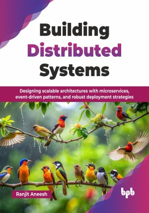

# Building Distributed Systems

Designing scalable architectures with microservices, event-driven patterns, and robust deployment strategies.

This is the repository for [Building Distributed Systems
](https://bpbonline.com/products/building-distributed-systems?_pos=1&_sid=8738ca4ca&_ss=r&variant=44607823315144),published by BPB Publications.

## About the Book
In today's digital landscape, distributed systems are the backbone of scalable and reliable applications, powering everything from e-commerce giants to real-time streaming services. This book, Building Distributed Systems, provides a practical and accessible guide to understanding and constructing these complex architectures, bridging the gap between foundational theory and real-world application.

In this book, we will dive into the fundamentals of distributed systems, understand how computing evolved and what are some critical aspects of these systems that software architects and engineers must always be aware of to help them make design and implementation decisions. Furthermore, we will learn to make tradeoff decisions grounded on key objectives that our systems should focus on versus what may not be so important for each specific use case.

By the end of this book, you will possess a strong understanding of distributed systems and be equipped to design, build, and deploy scalable and reliable applications. You will gain practical insights into modern architectures, enabling you to confidently tackle the challenges of building and maintaining distributed systems in any environment.

## What You Will Learn
• Architect microservices, implement caching, and deploy resilient distributed systems.

• Master event-driven patterns, traffic routing, and cloud platform selection.

• Design for consistency, availability, and implement robust data strategies.

• Optimize performance via CI/CD, load balancing, and advanced caching.

• Engineer fault-tolerant systems using CQRS, circuit breakers, and cloud services.

• Navigate CAP theorem trade-offs and build observable distributed architectures.

• Deploy with feature flags, Kubernetes, and ensure operational readiness.

• Build scalable systems, manage data, and optimize cloud infrastructure.
